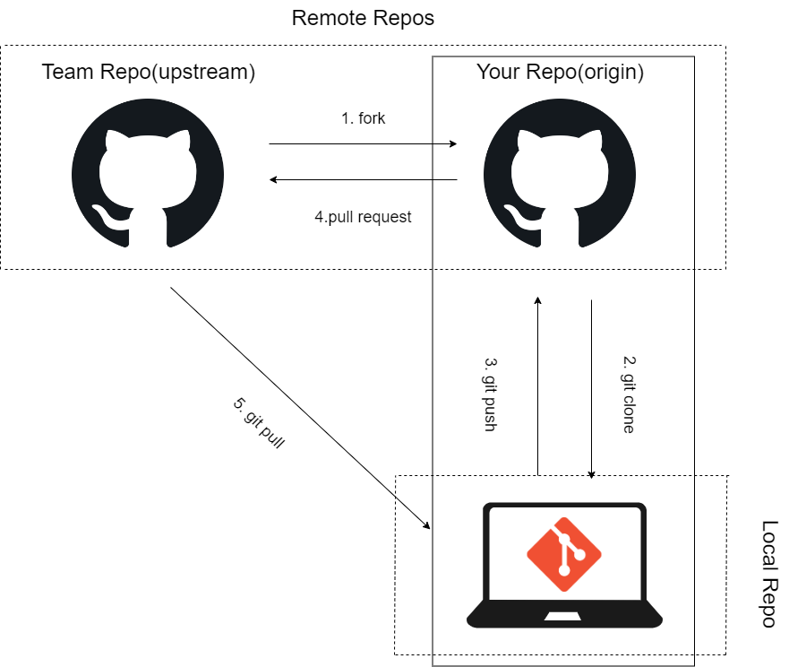

# Git，GitHubを使用した開発の流れ

## リモートリポジトリ，ローカルリポジトリの作成
1. GitHubで作業用のリポジトリを検索(URL：https://github.com/Data-Campus/Git-GItHub-tutorial.git)
2. 画面の右上の「fork」からforkする．
3. クローンする：`git clone https://github.com/[ユーザ名]/Git-GitHub-tutorial.git`
4. クローンしたフォルダに移動：`cd [クローンしたフォルダ名]`
5. upstreamの登録：`git remote add upstream https://github.com/Data-Campus/Git-GItHub-tutorial.git`
6. `git remote -v`で以下のように出力されればOK
```
origin  https://github.com/[ユーザ名]/Git-GitHub-tutorial.git (fetch)
origin  https://github.com/[ユーザ名]/Git-GitHub-tutorial.git (push)
upstream        https://github.com/Data-Campus/Git-GItHub-tutorial.git (fetch)
upstream        https://github.com/Data-Campus/Git-GItHub-tutorial.git (push)
```

**注意：ここではチュートリアル用のリポジトリのリモートリポジトリ．ローカルリポジトリを作成している．開発なら開発用リポジトリに対して同様のことを行う．**
## 大まかなイメージ(ブランチはのちほど説明)



## ハンズオンチュートリアル
### 自分用のディレクトリを作成して，そこに「Hello, GitHub」と出力するジュピターノートブックを作成しよう

1. GitHubユーザ名と同じまたは似ている名前のファイルを作成．
2. 拡張子が`.ipynb`のファイルを作成．
3. 最低限，`Hello GitHub`を出力するようにプログラムする．
4. `git add .`を入力．これは変更点をステージングに移動している．
5. `git commit -m 'コメント'`を入力．これは変更点に対する履歴を残す．
6. `git push origin main`を入力．これはローカルリポジトリの変更点を，リモートリポジトリ(origin)に反映させる．
7. プルリクエストを実行．
8. マージされるのを確認して一連の流れは終了．


## ブランチの切り方


### 今回使用するブランチは以下のもととする
- **master(main)**：リリース用のブランチ．ここでは作業しない．
- **develop**：開発用のブランチ．コードが安定し，リリース準備できたらrelease
へマージする．
- **release**：基本的には安定したものをここに留める．リリース時にdevelop，mainにマージする．
- **feature**：機能を追加ためのブランチ．developから分岐する．
- **hotfix**: バク対策用の緊急避難用のリポジトリ


**具体的なコマンドはRecursionのgitを参考にする．**

### ブランチ関係のルール
- `git branch feature\issue01\ユーザ名`といったようにつける．
- 開発にかかわるプルリクエストを出したときはdiscordで連絡，ほかのメンバーからの承認をもらう．ブランチを切ったときはそれも付け加える．(ex. 新しい○○ブランチを切って何々にかかわる追加をした)．もちろんプルリクエストでも確認するけど，これがあるとやりやすい．